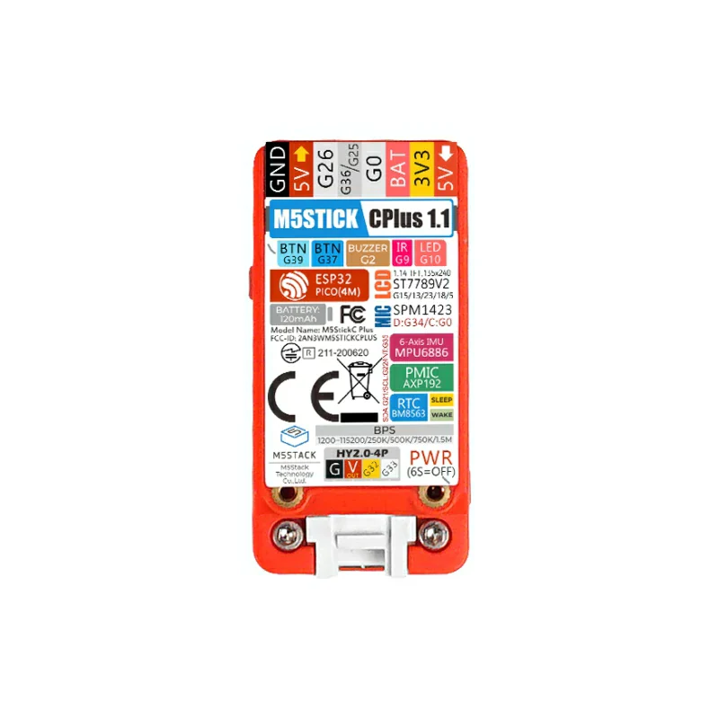
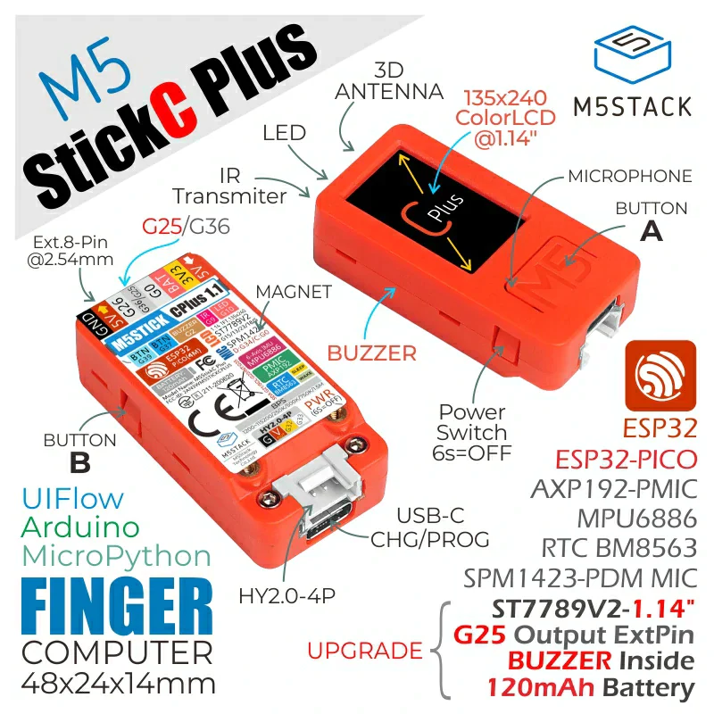

# tamagorust
Try embeded rust on m5 stick

## Some commands

- `just`
- `screen /dev/ttyUSB0 115200` (Ctrl + A, K to exit)
- `minicom -D /dev/ttyUSB0 -b 115200` (Ctrl + A, X to exit)
- `ls -la /dev/ttyUSB*` (to check if device plugged, and find the correct port)


## Devices infos

```sh
espflash board-info --list-all-ports
✔ Use serial port '/dev/ttyUSB0'? · yes
[2024-03-17T23:13:39Z INFO ] Serial port: '/dev/ttyUSB0'
[2024-03-17T23:13:39Z INFO ] Connecting...

[2024-03-17T23:13:39Z INFO ] Using flash stub
Chip type:         esp32 (revision v1.0)
Crystal frequency: 40 MHz
Flash size:        4MB
Features:          WiFi, BT, Dual Core, 240MHz, Embedded Flash, Coding Scheme None
MAC address:       a#:##:##:##:##:##
```




## Resources
- https://shop.m5stack.com/products/m5stickc-plus-esp32-pico-mini-iot-development-kit?variant=43983456764161
- https://github.com/esp-rs/esp-idf-template/
- cargo generate esp-rs/esp-idf-template cargo
- https://apollolabsblog.hashnode.dev/edge-iot-with-rust-on-esp-connecting-wifi
- https://apollolabsblog.hashnode.dev/esp32-embedded-rust-at-the-hal-button-controlled-blinking-by-timer-polling
- https://www.espressif.com/sites/default/files/documentation/esp32-pico_series_datasheet_en.pdf
- https://github.com/esp-rs/esp-idf-hal/tree/master/examples
- 


## Steps
- [ ] Run embassy no-std
- [ ] Have a blinking led
- [ ] Have all buttons working
- [ ] Have the screen working
- [ ] Have sound working
- [ ] Have accelerometer working
- [ ] Build a Simon game
- [ ] ...cker ps